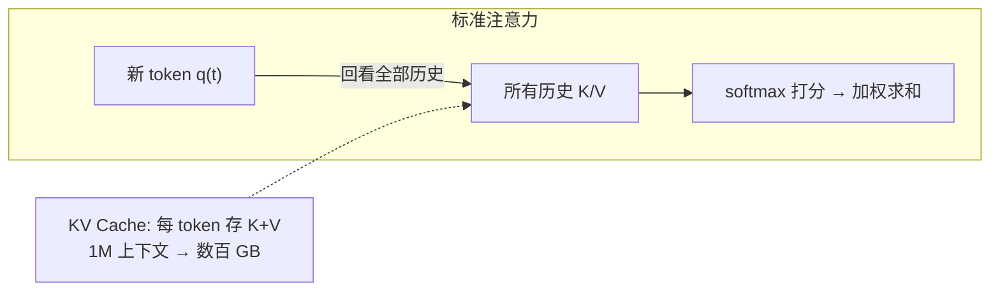
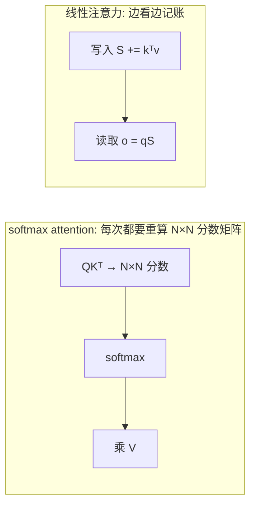
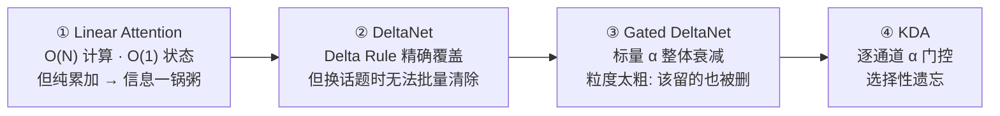
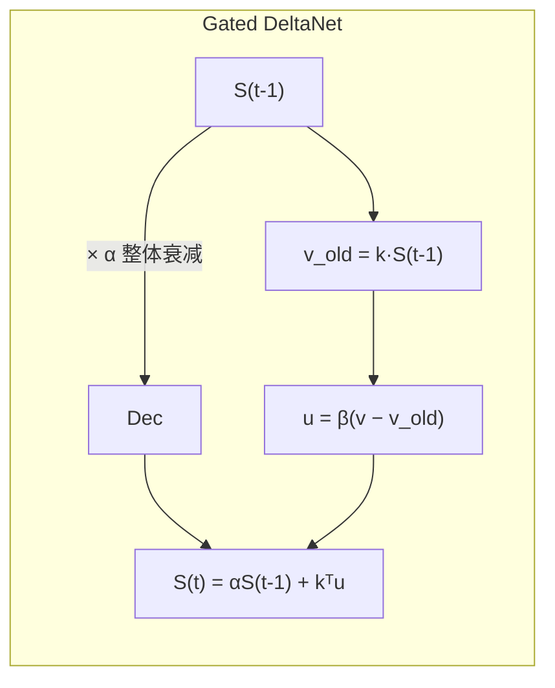
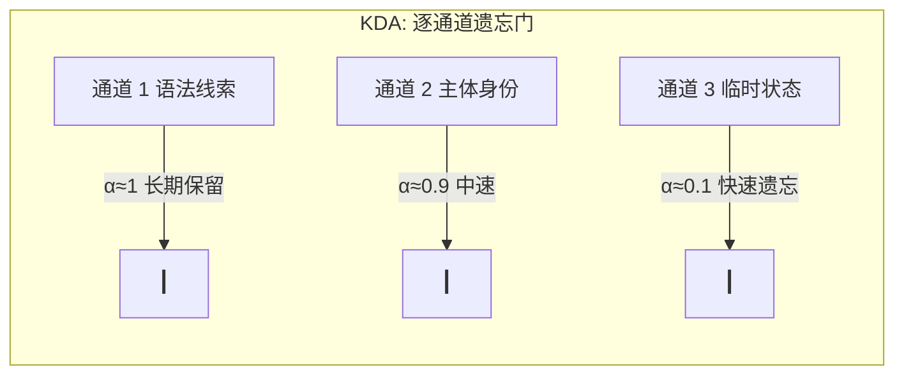
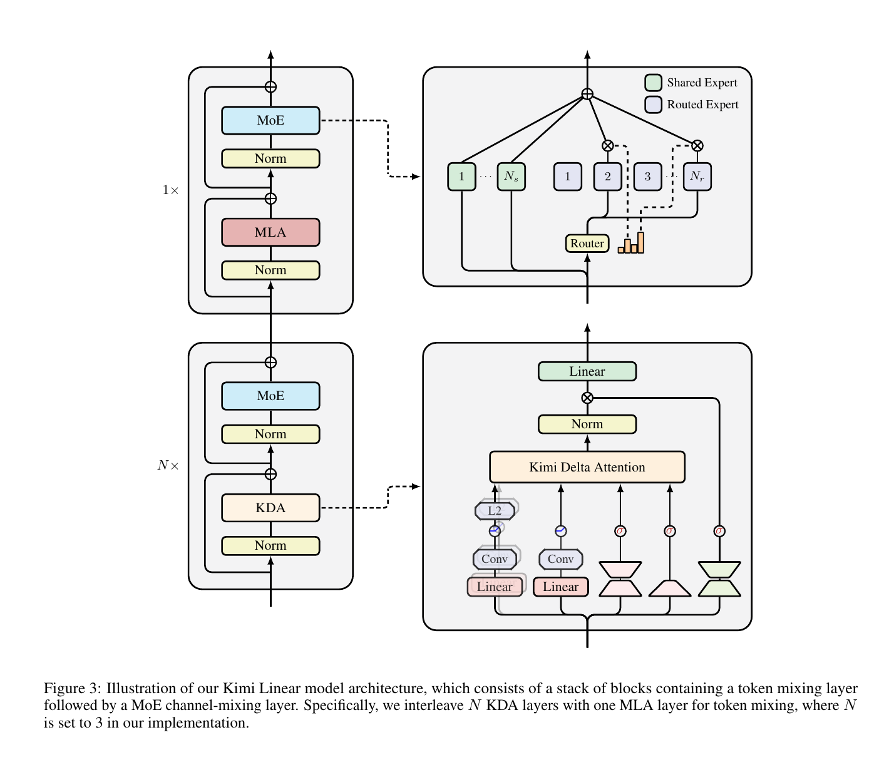
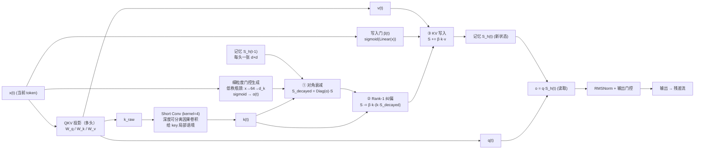
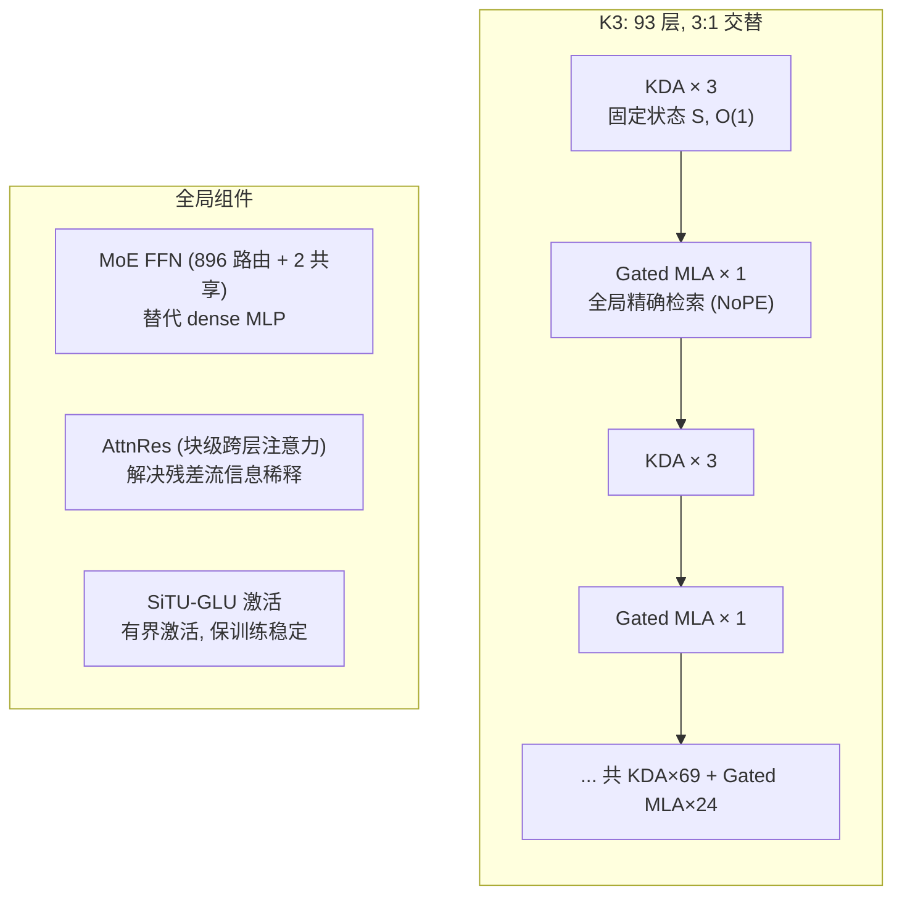
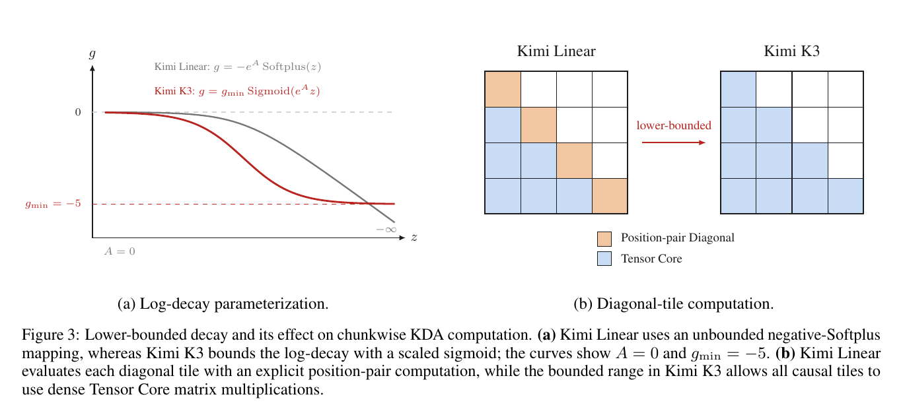

# KDA（Kimi Delta Attention）详解

> **一句话定义**：KDA（Kimi Delta Attention）是 Kimi K3 前 3 层使用的线性注意力，它把 softmax attention（标准注意力）换成一张**固定大小**的 `d×d` 记忆状态（`S`），用 **Delta Rule 精确覆盖** + **逐通道遗忘门控**来读写这张表，从而把 KV Cache 从随序列 `O(N)` 增长降为恒定，解码更快、更省显存。
>
> 本文从背景与基础知识讲起，给出完整公式、结构图和可运行的代码，最后落到它在 Kimi K3 里的位置。

***

## 0. 这篇文章讲什么

```
阅读路线：
1. 背景    —— 长上下文下 Transformer 的记忆为什么贵（KV Cache）
2. 基础    —— 从 softmax attention 到"记账本"的思维转换
3. 演进    —— Linear → DeltaNet → Gated DeltaNet → KDA（公式 + 结构图）
4. 结构    —— KDA 内部数据流 + 它在 Kimi K3 里的位置
5. 代码    —— 可运行的 KDA 最小实现 + 分块并行示意
6. 权衡    —— 复杂度、块大小 C 的取舍
```

**前置知识**：Softmax 注意力、KV Cache、矩阵乘法结合律。如果你已经看过线性注意力家族笔记，第 2、3 节可快速扫过，重点看第 3.4 节（逐通道门控）和结构图。

***

## 1. 背景：Transformer 的"记忆"为什么贵

### 1.1 标准注意力在做什么

标准 Softmax 注意力让**每个新 token 回看所有历史 token**：

$\text{Attention}(Q,K,V) = \text{softmax}\Big(\frac{QK^\top}{\sqrt{d}}\Big)V$

- 计算复杂度：$O(N^2 d)$，序列翻倍、算力翻四倍。
- 记忆（KV Cache）：每个 token 存一份 $K$ 和 $V$，随序列**线性增长** $O(N)$。



**数字直觉**：上下文 1M token 时，KV Cache 要占数百 GB 显存，且 decode 每一步都要读一遍越来越大的缓存——瓶颈不是算力，是**内存带宽**。

### 1.2 三种"降本"思路（知识铺垫）

针对"记忆随序列增长"这一核心矛盾，业界有三条主线：

| 路线       | 代表                          | 攻击点              | 效果          |
| -------- | --------------------------- | ---------------- | ----------- |
| 压缩 KV 维度 | MLA（DeepSeek/Kimi）          | 每 token 的 KV 字节数 | KV 压缩 \~98% |
| 稀疏化      | NSA / MoBA / SWA            | 只让"相关"的 token 互看 | 把 N² 变成 N·k |
| **线性化**  | Linear / DeltaNet / **KDA** | 用固定状态替代 KV Cache | 记忆恒定 O(1)   |

本文主角 **KDA 属于第三条线**：不存历史，而是把历史"压缩"进一张恒定大小的状态矩阵 `S`。

***

## 2. 基础知识：从"回忆全部"到"记账本"

线性注意力的核心是一个**思维转换**：利用矩阵乘法结合律，把"先打分再加权"改成"边看边记账，最后查账"。

原始：$(QK^\top)V$ —— 必须先算 $N\times N$ 的分数矩阵。

线性（行向量约定 $q_t,k_t,v_t \in \mathbb{R}^{1\times d}$，状态 $S_t \in \mathbb{R}^{d\times d}$）：

$o_t = \sum_{j\le t} \phi(q_t)^\top \phi(k_j)\, v_j = \phi(q_t)^\top \Big(\underbrace{\sum_{j\le t}\phi(k_j) v_j}_{S_t}\Big)$



- **写入**：$S_t = S_{t-1} + k_t^\top v_t$（外积累加，把这一条记进账本）
- **读取**：$o_t = q_t S_t$（query 当"指针"查账）
- 关键收益：**不管序列多长，`S`** **都是** **`d×d`** **恒定大小**。
- 代价：状态有容量上限，写多了会互相干扰（详见下一节）。

***

## 3. 演进链：Linear → DeltaNet → Gated DeltaNet → KDA

KDA 不是凭空出现的，它是这条演进链的终点。整条链每一步都解决上一步的一个局限：



### 3.1 第一站：Linear Attention —— 纯累加的"黑板"

$S_t = S_{t-1} + k_t^\top v_t$

问题：**只加不擦**。相似 key 反复写同一方向，旧值永远叠加在新值上：

```
写入 k=[1,0]→v1=[3,4]，再写 k=[1,0]→v2=[5,6]：
  S = kᵀv1 + kᵀv2 = kᵀ(v1+v2)
  读取 kS = [8,10] = v1+v2   ← 叠加！期望的是 v2
```

→ 记忆相互干扰（interference），写入方向越多越分不清。

### 3.2 第二站：DeltaNet —— 精确覆盖的"白板笔+行擦"

Delta Rule 的思想：写入前**先读旧值，只写"差值"**（来自 Widrow-Hoff 的在线学习规则，1960）。

$S_t = S_{t-1} + \beta\, k_t^\top \big(v_t - k_t S_{t-1}\big)$

三步：

1. 检索旧值：$v_{\text{old}} = k_t S_{t-1}$（这个 key 当前存了什么？）
2. 算误差：$u = \beta(v_t - v_{\text{old}})$（新值 - 旧值）
3. 写差值：$S_t = S_{t-1} + k_t^\top u$

**为什么这叫"精确覆盖"**（归一化 $k\cdot k=1$ 时）：

$kS_{\text{new}} = k\big[S + k^\top(v - kS)\big] = kS + (k\cdot k)(v - kS) = v \quad \checkmark$

写入后同一 key 读到的就是干净的新值 `v`，而不是历史叠加。

> 问题仍在：DeltaNet 只能擦"当前 key 指向的方向"。上下文切换时，旧话题的记忆还赖在账本里，只能等被覆盖，**无法主动清场**。

### 3.3 第三站：Gated DeltaNet —— 加一个全局衰减旋钮

Mamba 的思路：每步把整个状态乘一个标量衰减 $\alpha$，让旧记忆指数淡出。

$S_t = \alpha\, S_{t-1} + \beta\, k_t^\top (v_t - k_t S_{t-1})$



- $\alpha=1$ → 退化为纯 DeltaNet；$\alpha=0$ → 一键清空。
- 局限：$\alpha$ 是**一个标量**，所有维度一视同仁。长期记忆和噪音通道被删得一样快——模型分不清"该留的"和"该忘的"。

### 3.4 第四站：KDA —— 逐通道门控，学会选择性遗忘

KDA 对 Gated DeltaNet 的关键升级：**遗忘门从标量变成向量**（细粒度门控），每个特征通道独立决定保留多少。技术报告给出的循环状态更新方程（**KDA 是多头实现**：每头一张 $d_k\times d_v$ 状态 $S_h$，公式对每个 head 独立成立；"通道"指头内状态矩阵的行）：

$S_t = \big(I - \beta_t\, k_t k_t^\top\big) \cdot \text{Diag}(\alpha_t) \cdot S_{t-1} + \beta_t\, k_t v_t^\top, \qquad \alpha_t \in (0,1)^{d_k}$

展开后等价于（注意是**先衰减、再纠偏**的顺序）：

$S_t = \text{Diag}(\alpha_t)S_{t-1} + \beta_t\, k_t^\top\big(v_t - k_t\,\text{Diag}(\alpha_t)S_{t-1}\big)$

- $\alpha_t \in \mathbb{R}^{H\times d_k}$ 是每个 token **由输入生成**的逐头逐维遗忘门（每头一个 $d_k$ 维向量，见 4.2 的低秩瓶颈网络），取值 $(0,1)$。
- 对每头状态矩阵 $S_h$ 来说，`Diag(α_h)·S_h` 按行（通道）缩放——**通道 = 头内** **$S_h$** **的行**（$d_k$ 个 key 特征维度）：某通道 $\alpha_{h,i}$ 接近 1 → 该维度信息长期保留；接近 0 → 快速遗忘。
- 与 Gated DeltaNet 的两个区别：① 遗忘门是**向量**而非标量；② 纠偏读取发生在**衰减后**的状态 $k_t\,\text{Diag}(\alpha_t)S_{t-1}$ 上（先忘再纠，而非先纠再忘）。
- 表达能力：**同一时刻、同一头内，不同通道可以处于不同的"记忆时长"**。语法/身份这类稳定线索放慢衰减通道，噪音/临时状态放快衰减通道。

> 💡 K3 细节：KDA 的衰减机制在技术报告里改成了**有界版本**（log 衰减 $g$ 经缩放 sigmoid clamp 到 $(g_{\min},0)$），既避免数值溢出，也让计算能完全跑在张量核心上；同时 K3 的 Gated MLA 层采用 **NoPE**（无位置编码），位置信息完全靠 KDA 的门控衰减隐式传递。



### 3.5 公式速查表

| 机制             | 写入公式                                                         | 能忘吗            |
| -------------- | ------------------------------------------------------------ | -------------- |
| Linear         | $S += k^\top v$                                              | 永远不忘（叠加）       |
| DeltaNet       | $S += k^\top \beta(v - kS)$                                  | 只忘被覆盖的 key     |
| Gated DeltaNet | $S = \alpha S + k^\top\beta(v-kS)$                           | 整体衰减（一视同仁）     |
| **KDA**        | $S = (I-\beta kk^\top)\text{Diag}(\alpha)S + \beta k v^\top$ | **逐通道衰减（选择性）** |

***

## 4. KDA 完整结构：官方数据流

KDA 不是一个孤立公式，而是一条完整流水线：**投影 → key 短卷积 → 细粒度门控生成 → 三步 DPLR 状态更新 → 输出生成**。

### 4.1 单 token 完整数据流（结构图）

**官方结构图**（Kimi Linear 技术报告 Figure 3：Kimi Linear 架构 + KDA 模块内部细节）：



> 图注原文：*Illustration of our Kimi Linear model architecture, which consists of a stack of blocks containing a token mixing layer followed by a MoE channel-mixing layer. Specifically, we interleave N KDA layers with one MLA layer for token mixing, where N is set to 3 in our implementation.*（此图出自 **Kimi Linear** 技术报告，原文称 MLA；K3 在其基础上给 MLA 加了门控，即下文统一使用的 **Gated MLA**。）
>
> 读图指南：左侧是整块堆叠结构（`N× KDA + 1× MLA` + MoE）；右侧放大的 **KDA 模块**展示内部组件——三条并行分支分别做 **L2 归一化**（q/k，保证 key 单位范数、Delta Rule 精确擦除的前提）、**短卷积 + σ 门控**（生成细粒度衰减 α 和学习率 β）、**Linear 投影**（v），汇合进状态更新单元，输出前过 **Norm + 门控**。来源：[arXiv:2510.26692](https://arxiv.org/abs/2510.26692)（PDF 第 6 页）。

下面是我按数据流重绘的等价结构图（标注更细，便于对照公式）：



**核心要点**：读写都发生在每头的 `d×d` 状态 `S_h` 上（共 H 张，互不共享），**状态大小不随序列增长**。对比标准注意力——KV Cache 是"越来越大的一摞纸"，`S_h` 是"可擦写的白板"。

### 4.2 关键部件细节

**① 状态更新的三步 DPLR 计算**：官方实现把状态更新拆成三步，利用"对角 + 低秩"（DPLR）结构避开 $O(d_k^2 d_v)$ 的昂贵矩阵乘：

```
S_decayed   = Diag(α)·S_prev                 ① 对角衰减     O(d_k·d_v)
S_corrected = S_decayed − β·k·(k·S_decayed)  ② Rank-1 纠偏   O(d_k·d_v)
S_new       = S_corrected + β·k·v            ③ KV 写入       O(d_k·d_v)
```

每步 FLOPs 从朴素 $O(d_k^2 d_v)$ 降到 $O(d_k d_v)$（$d_k=4096$ 时约 **2000× 加速**）。

**② 细粒度门控（α）怎么来**：$\alpha_t$ 不是独立学习的参数，而是由当前 token 输入过**低秩瓶颈网络**生成：

$h = \text{SiLU}(W_\alpha x)\in\mathbb{R}^{d_g}, \qquad \alpha_t = \text{sigmoid}(W_{\alpha,\text{down}} h)\in(0,1)^{d_k}$

瓶颈维度 $d_g \approx 64$（远小于 $d_k=4096$），参数量从 $d_{\text{model}}\times d_k$ 降到 $(d_{\text{model}}+d_k)\times 64$（约省 **64×**）；实际输出是 $H\times d_k$（每头一个 $d_k$ 维向量），再给 $\alpha$ 加下界（有界版本）保证数值稳定。

**③ key 上的短卷积（Short Conv）**：key 进入循环前先过一层深度可分离因果卷积（kernel=4），给 key 提供**局部语境感知**——`S` 记全局，卷积让每个位置知道"附近在讲什么"。

**④ 输出生成**：读 `o_h = q_h·S_h`（每头各自读取）之后还要过 **RMSNorm 稳定 + 输出门控**，才进入残差流。

***

## 5. KDA 在 Kimi K3 里的位置（结构图）

KDA 不是单独用的。固定状态 `S` 有容量上限，长距离精确检索仍是弱项，所以 Kimi K3 采用 **3:1 混合**：3 层 KDA（快、O(1) 记忆）+ 1 层 Gated MLA（慢、但能全局精确检索），重复成组。技术报告披露：**K3 共 93 层 = KDA × 69（74%）+ Gated MLA × 24（26%）**，从第 0 层起按 `KDA×3 → Gated MLA×1` 交替。

> **Gated MLA 是什么**：Gated MLA（门控多头潜在注意力）属于标准注意力（MHA）家族——它仍然做 softmax 全局打分，只是把每层的 KV 先压进一个低维 latent 再做多头上投影（并加一层门控），从而把每 token 的 KV 内存从 `2×d` 压到 `~576` floats（压缩 \~98%）。**它的"精确全局检索"与 MHA 一脉相承**，与 KDA 的"固定状态近似检索"是本质不同的两种检索范式。K3 的 MLA 采用 **NoPE**（无位置编码），位置信息由 KDA 的门控衰减隐式提供。



**KV Cache 全景对比**（推理时）：

| 层类型              | 记忆内容                                    | 是否随序列增长    |
| ---------------- | --------------------------------------- | ---------- |
| KDA 层（×69）       | DeltaNet 状态 $S$（$d\times d$）            | **固定，不增长** |
| Gated MLA 层（×24） | latent $c$ + rope key（576 floats/token） | 增长，但极小     |
| 纯 Transformer    | 每层都存 K+V                                | 每层都线性增长    |

实际收益（Kimi 官方 / 技术报告口径）：**KV Cache 内存最高降 \~75%，1M token 上下文下解码速度最高提升 \~6×**——因为约 3/4 的层（69/93）不需要读越来越大的缓存。

***

## 6. 代码实现

> 把本段保存为 `.py` 文件即可直接运行（需已安装 PyTorch）。

```python
"""
KDA（Kimi Delta Attention）最小可运行示例
=========================================
串行递归形式（行向量约定，d=4 便于手算），官方三步 DPLR 计算：
    S_t = (I − β·k·kᵀ)·Diag(α_t)·S_{t-1} + β·k·vᵀ
对比三种记忆机制：Linear（累加）/ Gated（标量 α）/ KDA（逐通道 α）。
"""
import torch

torch.manual_seed(0)
d = 4
BETA = 0.8

# ---------- 工具函数 ----------
def read(S, k):
    """用 key 检索状态：o = k @ S"""
    return k @ S

def kda_step(S, q, k, v, alpha, beta=BETA):
    """KDA 一步状态更新（官方三步 DPLR 计算）"""
    # ① 对角衰减：每个特征通道独立衰减（α 是向量）
    S = alpha.unsqueeze(1) * S
    # ② Rank-1 纠偏：读"衰减后状态"的旧值，只写差值
    v_old = read(S, k)
    S = S - beta * torch.outer(k, v_old)
    # ③ KV 写入：外积写入新值
    S = S + beta * torch.outer(k, v)
    # 读取输出（query 当指针）
    o = read(S, q)
    return S, o

def gated_step(S, q, k, v, alpha, beta=BETA):
    """Gated DeltaNet：α 是标量（所有通道同衰减率），其余同 KDA"""
    S = alpha * S
    v_old = read(S, k)
    S = S - beta * torch.outer(k, v_old) + beta * torch.outer(k, v)
    return S, read(S, q)

# ---------- 构造场景：两话题 + 一个切换 token ----------
k_a   = torch.tensor([1.0, 0.1, 0.0, 0.0]); k_a = k_a / k_a.norm()   # 话题 A
k_b   = torch.tensor([0.1, 1.0, 0.0, 0.0]); k_b = k_b / k_b.norm()   # 话题 B
k_sw  = torch.tensor([0.0, 0.0, 0.0, 1.0]); k_sw = k_sw / k_sw.norm()# 切换信号
v_a   = torch.tensor([3.0, 1.0, 0.5, 0.2])
v_b   = torch.tensor([0.2, 4.0, 1.0, 0.3])

events = [("写 A", k_a, v_a), ("写 B", k_b, v_b), ("SWITCH", k_sw, torch.zeros(d))]

def run(step_fn, alpha_switch):
    S = torch.zeros(d, d)
    for label, k, v in events:
        if label == "SWITCH":
            S, _ = step_fn(S, k, k, v, alpha_switch)   # 切换: 用同一个 key 检索
        else:
            S, _ = step_fn(S, k, k, v, torch.tensor([0.99]*d) if step_fn is kda_step else 0.99)
    # 切换后检查: 话题 A/B 是否还在
    return read(S, k_a), read(S, k_b)

# Gated: 切换时全局 α=0.05（一刀切，A/B 一起被删）
ga, gb = run(gated_step, alpha_switch=0.05)
# KDA:   切换时只有"临时通道"快速衰减，稳定通道保留
alpha_sw = torch.tensor([0.99, 0.99, 0.05, 0.05])     # 前2维长期、后2维短期
ka, kb = run(kda_step, alpha_switch=alpha_sw)

print(f"Gated 切换后 → A:{ga.tolist()}  B:{gb.tolist()}  (整体衰减, 都被删)")
print(f"KDA   切换后 → A:{ka.tolist()}  B:{kb.tolist()}  (选择性: 稳定通道保留)")
```

**结果解读**：切换话题时，Gated 用一个标量把 A、B 一起衰减；KDA 则让"稳定通道"（前两维）$\alpha\approx1$ 保留 A/B 的长期身份信息，"临时通道"（后两维）$\alpha\approx0.05$ 快速清空——这就是"**选择性遗忘**"。

### 6.1 分块并行（训练视角，示意）

串行的 KDA 无法直接喂 GPU。训练时用**变量替换**把"擦除"藏进变换后的 key（完整推导见下文公式）：

$W_t = \prod_{i\le t}(I - \beta k_i^\top k_i), \qquad U_t = W_t^{-1} S_t \;\Rightarrow\; U_t = U_{t-1} + \tilde{k}_t^\top v_t$

替换后块内退化成标准 masked 矩阵乘（一次算一个块 $C$ 个位置），块间只串行传三个 `d×d` 矩阵：

```python
# 块 b（大小 C）输出，一次矩阵乘出 C 个位置：
#   U_出口 = U_入口 + K̃_bᵀ @ V_b
#   O_b    = mask(Q_b @ W_b @ K̃_bᵀ) @ V_b + (Q_b @ W_b) @ U_入口
# 块间串行 N/C 步，传 U / W / W⁻¹
```

> 💡 官方实现（FlashKDA）用的是 **WY 表示 + UT 变换**：把块内 C 个 rank-1 更新打包成两次矩阵乘，用前向替换替代矩阵求逆，把非 matmul FLOPs 从 \~18% 降到 \~6%——Prefill 比 flash-linear-attention 基线快 **1.72–2.22×**。

**官方图**（K3 技术报告 Figure 3：lower-bounded 衰减及其对 chunkwise KDA 计算的影响）：



> 图注原文：*Lower-bounded decay and its effect on chunkwise KDA computation. (a) Kimi Linear uses an unbounded negative-Softplus mapping, whereas Kimi K3 bounds the log-decay with a scaled sigmoid; the curves show A = 0 and gmin = −5. (b) Kimi Linear evaluates each diagonal tile with an explicit position-pair computation, while the bounded range in Kimi K3 allows all causal tiles to use dense Tensor Core matrix multiplications.*
>
> 直觉：Kimi Linear 的衰减映射 $g = -\text{Softplus}(z) \in (-\infty, 0)$ 无下界，K3 改为**缩放 sigmoid**：$g = g_{\min}\,\text{Sigmoid}(e^{A}z) \in (g_{\min}, 0)$（如 $g_{\min}=-5$）。有界之后，chunkwise 的对角块不再需要显式的位置对计算，全部退化为**稠密 Tensor Core 矩阵乘**——这是"硬件条件反向塑造算法设计"的典型例子。来源：[MoonshotAI/Kimi-K3 技术报告](https://github.com/MoonshotAI/Kimi-K3/blob/main/k3_tech_report.pdf)（PDF 第 5 页）。

***

## 7. 复杂度与权衡

| 指标   | 标准注意力            | KDA（分块）                     |
| ---- | ---------------- | --------------------------- |
| 计算   | $O(N^2 d)$       | $O(NCd)$（$C$=块大小，$N/C$ 步串行） |
| 每层记忆 | KV Cache $O(Nd)$ | 状态 $O(d^2)$，**恒定**          |
| 训练并行 | 全并行              | 块内并行 + 块间 $N/C$ 步           |

**单步状态更新的 DPLR 优化**：每步朴素更新是 $O(d_k^2 d_v)$，拆成"对角衰减 + 两次 rank-1 外积"后降到 $O(d_k d_v)$（见 4.2）——这是 KDA 能跑上 Tensor Core 的关键。

**块大小 C 的取舍**（训练时的关键超参）：

```
C=1     理论 FLOPs 最低，但每步只有 1 个 token，GPU 喂不饱
C=64/128 块内 C×C 矩阵乘匹配 Tensor Core tile → 实测最快
C=N     退化为标准注意力 O(N²)
```

多花的 $O(NCd)$（对比纯线性 $O(Nd^2)$）是**用重复计算换并行度**——机器实测甜点通常在 $C=64/128$。

**KDA 的固有代价**：固定状态 `S` 有容量上限，极端长距离的精确检索不如标准注意力——这正是 Kimi K3 要 3:1 混入 Gated MLA 层的原因。

***

## 8. 总结

1. **问题**：标准注意力的 KV Cache 随序列线性增长，长上下文时内存带宽成为瓶颈。
2. **线性化**：用恒定 `d×d` 状态 `S` 替代 KV Cache，把复杂度从 $O(N^2)$ 拉到 $O(N)$。
3. **三连升级**：Linear（累加干扰）→ DeltaNet（精确覆盖）→ Gated（整体衰减）→ **KDA（逐通道衰减，选择性遗忘）**。
4. **KDA = 固定大小记忆 + 精确覆盖 + 逐通道门控（细粒度门控）**；在 K3 中与 Gated MLA 按 3:1 混合（93 层 = 69 KDA + 24 Gated MLA），兼顾速度与全局检索。
5. **工程收益**：KV 内存降 \~75%、1M 上下文解码快 \~6×；代价是状态容量有限，且训练需要分块并行（$O(NCd)$）+ DPLR 拆解 + FlashKDA 内核。

### 易错点

- **外积 vs 内积**：$k_t^\top v_t$ 是 $(d,d)$ 外积矩阵，不是标量；$k_t \cdot k_t$ 才是标量。
- **擦除是左乘**（行向量约定）：$E_t S_{t-1}$，矩阵乘法不交换，$S_{t-1}E_t$ 是错的。
- **先衰减、再纠偏**：官方 KDA 的纠偏读取的是**衰减后**的状态 $k_t\,\text{Diag}(\alpha_t)S_{t-1}$，不是原始状态——顺序不能换。
- **输出用 q，检索用 k**：$o_t = q_t S_t$（生成下一个 token），$v_{\text{old}} = k_t S_{t-1}$（覆盖前查旧值），两个读取别混。
- **mask 不满足结合律**：$\text{mask}((QW)\tilde K^\top)V \neq (QW)(\tilde K^\top V)$，分块训练必须保持顺序，否则未来信息泄露。
- **$\beta < 1$** **保证可逆**：变量替换 $U=W^{-1}S$ 需要 $W$ 可逆（$\beta=1$ 时 $E$ 奇异）。

### 思考问题

- "KV Cache 为什么贵？如何做到记忆不随序列增长？" → 线性注意力 / KDA 动机。
- "Delta Rule 和纯累加的区别？为什么精确覆盖更稳（数值有界、检索干净）？"
- "Gated DeltaNet 和 KDA 的区别？" → 标量门控 vs 逐通道门控（选择性遗忘），以及"先衰减再纠偏"的顺序。
- "KDA 的 α 从哪来？" → 低秩瓶颈网络（x→64→d\_k）+ sigmoid + 有界化。
- "KDA 训练怎么并行？" → 变量替换 $U = W^{-1}S$ + 分块 masked 矩阵乘 + WY/UT 变换（FlashKDA）。
- "为什么 K3 要 KDA 和 Gated MLA 混用？" → 固定状态容量有限，Gated MLA 定期补充全局精确检索；且 Gated MLA 用 NoPE，位置信息由 KDA 门控衰减承担。

